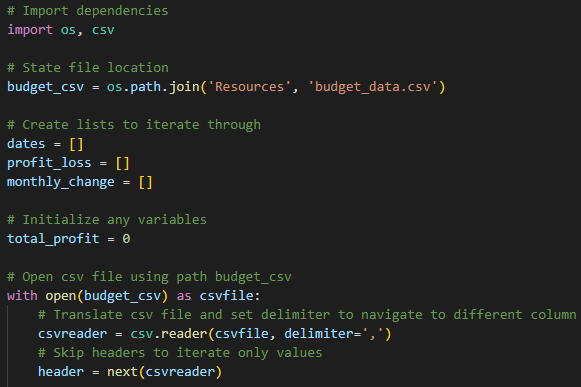
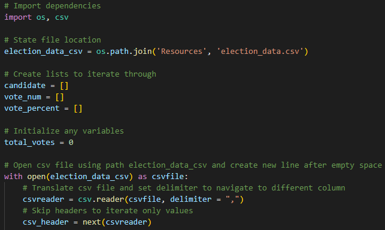
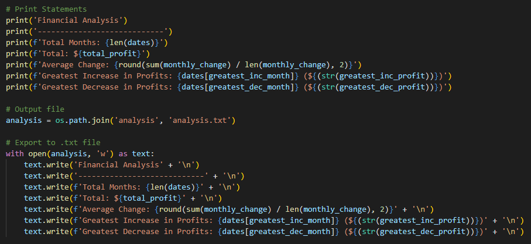
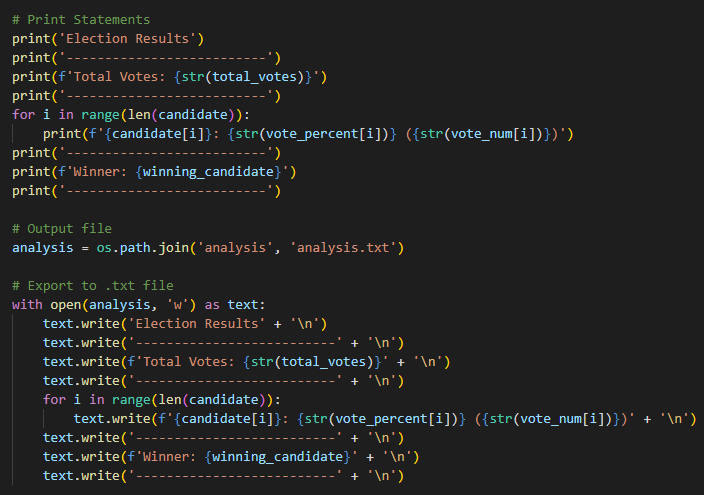
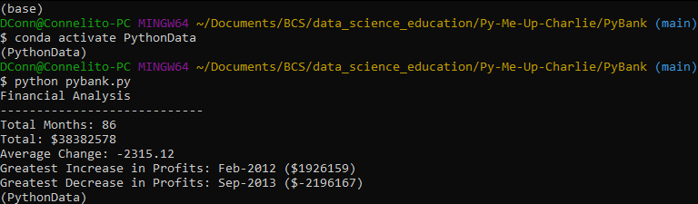
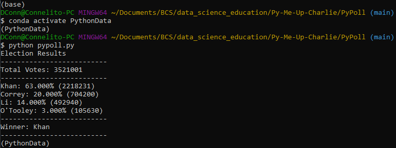

# Py Me Up, Charlie

### PyBank

  

I wanted to create a Python script for analyzing the financial records of a company by using this set of [financial data](PyBank/Resources/budget_data.csv). The dataset is composed of two columns: `Date` and `Profit/Losses`.

I will create a Python script that analyzes the records to calculate each of the following:
  * The total number of months included in the dataset
  * The net total amount of "Profit/Losses" over the entire period
  * The average of the changes in "Profit/Losses" over the entire period
  * The greatest increase in profits (date and amount) over the entire period
  * The greatest decrease in losses (date and amount) over the entire period

In addition, my final script will print the analysis to the terminal and export a text file with the results.

  - - -

### PyPoll

  

I wanted to help a small, rural town modernize its vote counting process using this set of [poll data](PyPoll/Resources/election_data.csv). The dataset is composed of three columns: `Voter ID`, `County`, and `Candidate`. 

I will create a Python script that analyzes the votes and calculates each of the following:
  * The total number of votes cast
  * A complete list of candidates who received votes
  * The percentage of votes each candidate won
  * The total number of votes each candidate won
  * The winner of the election based on popular vote.

In addition, my final script will print the analysis to the terminal and export a text file with the results.

  - - -

### Correctly read in csv
  
  

### Results Printed out correctly to terminal
  
  

### Code Runs Error Free
  
  

### Exports results to text file
  
  ![PyPoll Export Text](Images/pypoll_export_text.png

  - - -

© Connelito